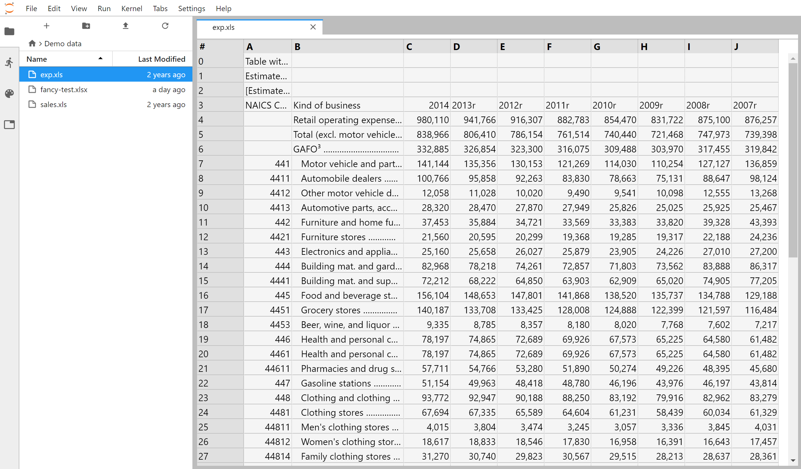

# JupyterLab Spreadsheet



This plugin adds a simple spreadsheet viewer to JupyterLab.

`jupyterlab-spreadsheet` supports XLS, XLSX, and CSV files, and allows for
basic formatting. The plugin is in alpha, and doesn't support all features of
workbooks (advanced formatting, cell merges, formulas, etc.).

## Getting Started

Installing `jupyterlab-spreadsheet` is easy. Just run the following command:

```bash
jupyter labextension install jupyterlab-spreadsheet
```

If you already have JupyterLab running, you just have to refresh the page.

To open a workbook, navigate to it in the file viewer and double-click on it.
To open CSV files in the plugin, right click on the file and use
"Open With > Spreadsheet".

## Contributing

Contributions are always welcome! `jupyterlab-spreadsheet` is built off of
the 6pac fork of SlickGrid, and uses SheetJS to parse workbooks.

When filing issues, please be sure to give reproduction steps and any relevant
error messages or console output. This helps me track down the cause and get a
fix out sooner.

## Building from Source

To build from sources, clone this repository into a convenient directory and
`cd` into it from a terminal. Then, run the following commands:

```bash
yarn install
yarn build
jupyter labextension install .
```

Then, start JupyterLab as you would normally. File watchers are available via
`yarn build --watch` and `jupyter lab --watch`.